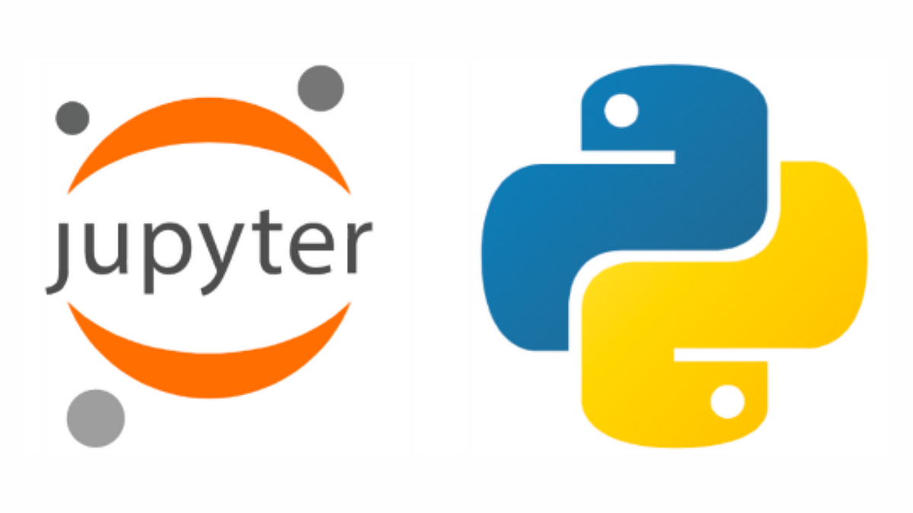

So, Learning Data Science using Python Programming Language with Jupyter Notebook is Interesting to me. as of now, I'm currently in my 4th Semester of Computer Science and Engineering in AI & ML (thats the branch I chose)
my department has told me and everyone else who has opted this branch, to learn about Data Science, Jupyter Notebook and Python Programming Language. ( I guess we are going to be having a data science related subject)

I decided to showcase it on my github and keep track of it, too ! 
its open and public, anybody can visit this repo and go through the files and what I'm learning.

